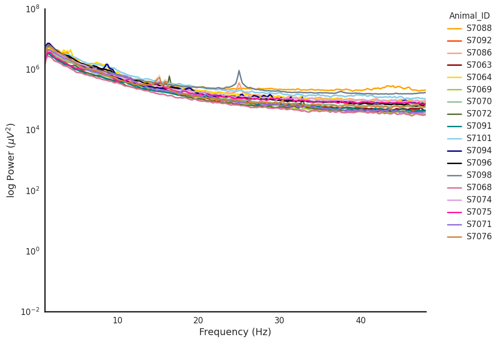

# ArtifactDetection: EEG Artifact Identification with the Spectral Slope

Quick installation from PyPI:

```bash
pip install ArtifactDetection
```

##  Overview

Analyzing EEG signals often involves looking at power spectra to identify dominant frequency bands, which is useful for sleep studies. However, noise can contaminate these recordings and increase overall power.

- ArtifactDetection removes these artifacts using the spectral slope method, which involves linear regression of the logarithmic EEG power spectra. This method, previously used to distinguish conscious states, can also identify epochs contaminated by noise.

- Unlike other EEG preprocessing methods that need multiple electrodes and advanced signal processing knowledge, ArtifactDetection requires no prior knowledge and can remove artifacts in a few lines of code!

<p align="center">
  
  
</p>

## Notebooks
**The following notebooks show you how to implement ArtifactDetection:**
1. [Preprocessing: formatting data correctly](https://github.com/melissafasol/ArtifactDetection/blob/main/demo_notebooks/preprocess.ipynb)

Power analysis requires that EEG recording files are in .npy format and corresponding brain state files are in .pkl format. If your files are already in that format, you can skip the preprocessing step.

2. [Power: run power analysis](https://github.com/melissafasol/ArtifactDetection/blob/main/demo_notebooks/power.ipynb)

3. [Analyse: threshold and plot](https://github.com/melissafasol/ArtifactDetection/blob/main/demo_notebooks/analyse.ipynb)


## Citation
If you use ArtifactDetection in your work, please cite it as follows:
```bibtex
@inproceedings{fasol2023single,
  title={Single-Channel EEG Artifact Identification with the Spectral Slope},
  author={Fasol, Melissa CM and Escudero, Javier and Gonzalez-Sulser, Alfredo},
  booktitle={2023 IEEE International Conference on Bioinformatics and Biomedicine (BIBM)},
  pages={2482--2487},
  year={2023},
  organization={IEEE}
}
```

## License
ArtifactDetection has a MIT license, as found in the LICENSE file.